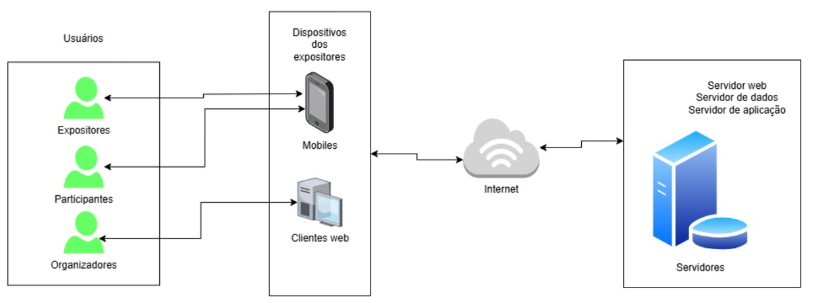

# Documento de Visão de Produto (DVP)

## Visão do Produto

**Sistema de Gestão da Feira de Produtos Orgânicos (SGFPO)**  
<small>Versão 1.0</small>

---

## Histórico de Revisões

| Data       | Versão | Descrição           | Autor              |
|------------|--------|---------------------|--------------------|
| 03/12/2024 | 0.1.0  | Criação do documento | Horta IFPB  |

---

## Sumário

1. [Introdução](#introdução)
   - [Propósito](#propósito)
   - [Definições e abreviações](#definições-e-abreviações)
2. [Escopo do Produto](#escopo-do-produto)
3. [Posicionamento](#posicionamento)
   - [Oportunidade de Negócios](#oportunidade-de-negócios)
   - [Descrição dos Benefícios e Problemas Resolvidos](#descrição-dos-benefícios-e-problemas-resolvidos)
4. [Descrição dos Stakeholders e Usuários](#descrição-dos-stakeholders-e-usuários)
   - [Stakeholders](#stakeholders)
   - [Usuários e Atores](#usuários-e-atores)
5. [Descrição do Ambiente de Uso](#descrição-do-ambiente-de-uso)
   - [Ambiente de Uso](#ambiente-de-uso)
6. [Visão Geral do Produto](#visão-geral-do-produto)
   - [Custo e Venda](#custo-e-venda)
   - [Licenciamento e Instalação](#licenciamento-e-instalação)
   - [Características e Funcionalidades de Alto Nível](#características-e-funcionalidades-de-alto-nível)
   - [Restrições](#restrições)

---

## Introdução

### Propósito

O **Sistema de Gestão da Feira de Produtos Orgânicos (SGFPO)** foi desenvolvido para organizar e gerenciar uma feira de produtos orgânicos em uma instituição de ensino. Ele otimiza o processo administrativo, desde a inscrição dos expositores até o controle de vendas e fluxo de participantes.

Este documento define as funcionalidades e requisitos do SGFPO, visando uma gestão eficiente, melhorando a comunicação e organização entre expositores, organizadores e clientes.

---

### Definições e Abreviações

### Abreviações

| Termo  | Definição                                        |
|--------|-------------------------------------------------|
| SGFPO  | Sistema de Gestão da Feira de Produtos Orgânicos|

### Definições

| Termo         | Definição                                           |
|---------------|----------------------------------------------------|
| **Expositores** | Vendedores de produtos orgânicos cadastrados na feira. |
| **Participantes** | Visitantes que comparecem à feira para comprar os produtos. |
| **Organizadores** | Equipe responsável pela organização e logística da feira. |
| **Produtos**     | Produtos orgânicos vendidos durante a feira.    |
| **Vendas**       | Registros de transações realizadas entre expositores e participantes. |

---

## Escopo do Produto

O **SGFPO** centraliza todas as informações necessárias para o funcionamento da feira, incluindo cadastro de expositores, controle de produtos, gerenciamento de vendas e geração de relatórios. Ele também possibilita o gerenciamento da programação e comunicação do evento.

---

## Posicionamento

### Oportunidade de Negócios

O **SGFPO** oferece:

- **Melhoria na experiência de expositores e participantes:** Facilitando o acesso às informações e aumentando a satisfação.
- **Facilidade na organização do evento:** Controlando inscrições, produtos e vendas, reduzindo erros administrativos.
- **Gestão financeira aprimorada:** Com relatórios detalhados para análise de desempenho financeiro.

---

### Descrição dos Benefícios e Problemas Resolvidos

| Benefício                       | Problema Resolvido                                   | Afetados                    |
|---------------------------------|-----------------------------------------------------|-----------------------------|
| Aumento da eficiência administrativa | Controle manual que gera erros e consome tempo.     | Organizadores               |
| Agilidade na comunicação         | Falta de centralização de informações.              | Organizadores e Expositores |
| Relatórios detalhados            | Ausência de dados em tempo real para análise.       | Organizadores               |
| Facilidade de cadastro           | Inscrição prática para expositores.                 | Expositores                 |

---

## Descrição dos Stakeholders e Usuários

### Stakeholders

| Stakeholder            | Descrição                                           | Papel                     |
|------------------------|---------------------------------------------------|--------------------------|
| Instituição de Ensino  | Responsável pela organização da feira.            | Organizador principal    |
| Expositores            | Vendedores dos produtos orgânicos.                | Usuários do sistema      |
| Participantes          | Visitantes da feira.                              | Usuários indiretos       |

### Usuários e Atores

| Usuário       | Descrição                                   | Responsabilidades                   | Stakeholders       |
|---------------|-------------------------------------------|-------------------------------------|--------------------|
| **Expositores** | Vendedores de produtos orgânicos.         | Cadastro de produtos e vendas.      | Expositores        |
| **Organizadores** | Responsáveis pela organização da feira.  | Gestão de inscrições e relatórios.  | Instituição        |
| **Participantes** | Visitantes da feira.                    | Realizar compras.                   | Instituição        |

---

## Descrição do Ambiente de Uso

### Ambiente de Uso

O SGFPO é um software que opera sobre uma infraestrutura de TI, dispensando a necessidade de equipamentos especializados. Para seu funcionamento, requer servidores, um banco de dados eficiente e dispositivos de rede, como roteadores e switches, que garantem a conectividade e o processamento de dados em tempo real.

Os usuários podem acessar o SGFPO por meio de navegadores web em dispositivos como computadores, laptops, tablets e smartphones, o que possibilita o gerenciamento remoto e flexível da feira, a qualquer momento e em qualquer lugar.

A interação com o SGFPO ocorre via conexão de rede, geralmente pela Internet. O servidor que hospeda o sistema processa solicitações HTTP recebidas dos dispositivos dos usuários e retorna as informações necessárias, permitindo o gerenciamento completo de expositores, participantes e vendas.

1. **Ambiente do Evento:**  
   O sistema será utilizado diretamente no evento, pelos expositores e participantes, com acesso por dispositivos móveis para organizar as atividades.  

2. **Ambiente Administrativo:**  
   Os organizadores poderão acessar o sistema por meio de seus computadores para gerenciar todos os dados relacionados à feira.  

---

### Necessidades Principais Quanto ao Ambiente

O uso do **SGFPO** deve atender a diferentes necessidades relacionadas ao ambiente de utilização. A tabela abaixo detalha as principais necessidades:

| **Necessidade**               | **Prioridade** | **Interesse**                                                                                     | **Solução Atual**                                                                                | **Soluções Propostas**                                                                                              |  
|-------------------------------|----------------|---------------------------------------------------------------------------------------------------|--------------------------------------------------------------------------------------------------|--------------------------------------------------------------------------------------------------------------------|  
| **Compatibilidade Multidispositivo** | Alta           | Os usuários esperam acessar o sistema de qualquer dispositivo, como desktops, tablets e smartphones. | Não há solução atual. A gestão é feita manualmente em cadernos e planilhas digitalizadas.         | Desenvolvimento de interface responsiva e aplicação híbrida para compatibilidade com múltiplos dispositivos.        |  
| **Acesso em Tempo Real**       | Alta           | Usuários esperam que dados sejam atualizados e acessados em tempo real durante o evento.           | Atualizações de dados feitas manualmente e consolidadas após o evento.                            | Integração de serviços em nuvem para sincronização em tempo real e acesso simultâneo por vários usuários.           |  
| **Interface Intuitiva**        | Alta           | Expositores e organizadores esperam uma interface amigável e fácil de usar, sem necessidade de treinamento. | Uso de cadernos e arquivos digitais simples, sem interface gráfica.                              | Design UX/UI simplificado com fluxos diretos e utilização de ícones e menus intuitivos.                              |  
| **Conexão Estável e Offline**  | Média          | A feira acontece em ambientes com internet instável; usuários precisam continuar usando o sistema offline. | Não aplicável, pois a gestão manual não depende de conectividade.                                | Implementar funcionalidade offline com sincronização automática quando a internet estiver disponível.                |  
| **Segurança de Dados**         | Alta           | Organizadores e expositores esperam que informações financeiras e pessoais sejam protegidas.        | Dados armazenados manualmente, suscetíveis a extravio ou acesso não autorizado.                   | Criptografia de dados, autenticação de dois fatores e controles de acesso restrito para proteger informações.        |  
| **Facilidade de Configuração** | Média          | Organizadores esperam configurar o sistema rapidamente para novas edições da feira.                | Ajustes manuais de documentos e arquivos entre eventos, propensos a erros e inconsistências.      | Ferramentas de configuração automatizadas, com interface passo a passo para facilitar a preparação do sistema.       |  

---

## Visão Geral do Produto

O Sistema de Gestão da Feira de Produtos Orgânicos (SGFPO) é um sistema de gerenciamento de vendas e controle de estoque de produtos em uma feira. Ele permite que os feirantes consigam ter maior facilidade em controlar o fluxo de caixa e estoque das mercadorias, já que concede acesso a todo o histórico de vendas, facilidade nas transações, além de controlar todo o estoque dos produtos apresentados como mercadoria.

Uma estrutura operacional do produto é apresentada na figura abaixo.

### Custo e Venda

O sistema será fornecido à instituição como uma solução única, podendo ser adaptado para futuras edições da feira.

### Licenciamento e Instalação

O SGFPO será licenciado para uso por evento, com instalação local ou em nuvem.

### Características e Funcionalidades de Alto Nível

- **Cadastro de Expositores e Produtos:** Registro rápido e intuitivo.
- **Controle de Vendas:** Gerenciamento de transações.
- **Relatórios Financeiros:** Geração automática de dados de desempenho.
- **Agenda de Programação:** Organização dos eventos dentro da feira.
- **Gestão de Participantes:** Controle do fluxo de visitantes.
---

### Restrições

- **Acessibilidade:** Deve ser intuitivo para todos os usuários.
- **Desempenho:** Rapidez na atualização de dados durante o evento.
- **Segurança:** Proteção de informações financeiras e pessoais.

---

**Validado por:**

<address>
<a href="sgfpo@ifpb.com.br"> HortaIFPB | Desenvolvimento do Sistema</a> 
contato@sgfpo.com.br 
SGFPO - Sistema de Gestão da Feira de Produtos Orgânicos 
Box 123, Terceirão, João Pessoa-PB 
BRA
</address>
---

Criado em Dezembro de 2024 por Equipe 6

---
